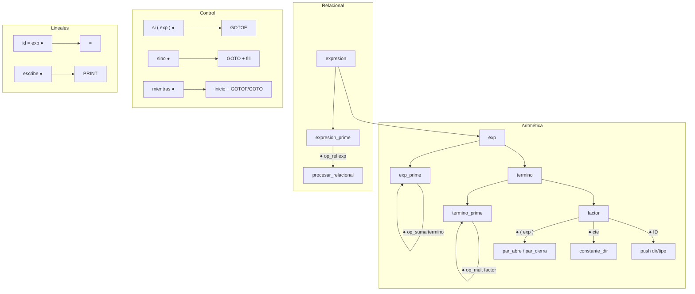
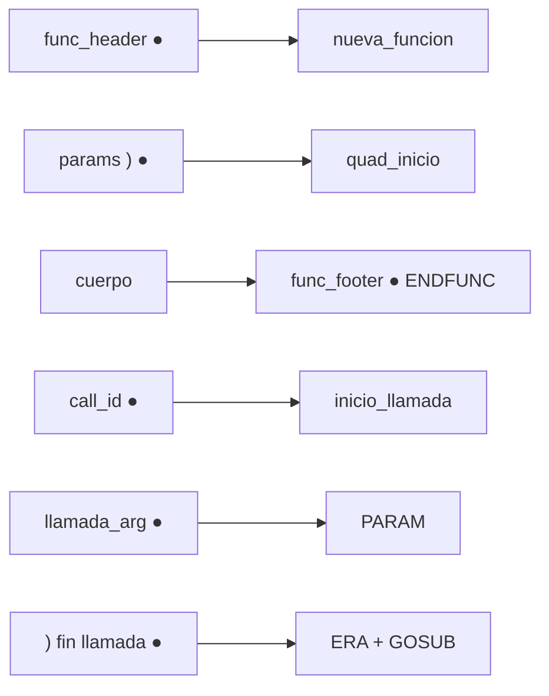

# Patito — Entrega 4 (Direcciones virtuales, control y funciones)

Compilador del lenguaje **Patito** (TC3002B): scanner, parser, semántica, **direcciones virtuales** y generación de cuádruplos para expresiones, estatutos de control y funciones.

## Requisitos

- Python 3.10+
- [PLY](https://github.com/dabeaz/ply): `pip install -r requirements.txt`

## Uso

```bash
cd Patito-entrega
python3 patito.py hola.patito
python3 patito.py --quad hola.patito       # fila de cuádruplos
python3 patito.py --dir hola.patito        # directorio de funciones + dir. virtuales
python3 patito.py --dv hola.patito           # mapa de direcciones virtuales
python3 patito.py --test-quad
```

## Distribución de direcciones virtuales

Diseño en `direcciones_virtuales.py`:

| Segmento   | Rango       | Uso |
|------------|-------------|-----|
| **Globales**   | 1000 – 1999 | Variables del bloque `vars` del programa principal |
| **Locales**    | 2000 – 4999 | Parámetros y variables locales de funciones |
| **Temporales** | 5000 – 7999 | Resultados intermedios de expresiones (`t` implícitos) |
| **Constantes** | 8000 – 9999 | Tabla de constantes numéricas (misma cte → misma dir.) |

Asignación:
- Al declarar variable global → `global_dir()`
- Al declarar parámetro o local en función → `local_dir()`
- Al generar temporal → `temporal_dir()`
- Al usar constante numérica → `constante_dir(valor, tipo)` con deduplicación

Los cuádruplos almacenan **direcciones virtuales** (enteros), no nombres simbólicos.

## Estructuras de generación

### Pilas (LIFO)

| Pila | Contenido | Uso |
|------|-----------|-----|
| Operadores | `+`, `-`, `*`, `/`, relaciones, `(` | Precedencia y paréntesis |
| Operandos | Direcciones virtuales | Argumentos de cuádruplos |
| Tipos | `entero` / `flotante` | Cubo semántico |
| Saltos | Índices de cuádruplos | Rellenar `GOTOF` / `GOTO` |

### Fila (FIFO)

Cuádruplos `(operador, op1, op2, resultado)` en orden de emisión.

### Operadores de cuádruplo

| Operador | Descripción |
|----------|-------------|
| `+`, `-`, `*`, `/`, `uminus` | Aritmética |
| `>`, `<`, `==`, `!=` | Relacional |
| `=` | Asignación |
| `PRINT` | `escribe` |
| `GOTOF`, `GOTO` | Condicionales y ciclos |
| `PARAM` | Pasa argumento a función |
| `ERA` | Crea registro de activación |
| `GOSUB` | Salto a `quad_inicio` de la función |
| `ENDFUNC` | Fin de función |

## Puntos neurálgicos

### Expresiones aritméticas

```
exp → termino exp_prime
exp_prime → op_suma termino exp_prime | op_resta termino exp_prime | ε
termino → factor termino_prime
termino_prime → op_mult factor termino_prime | op_div factor termino_prime | ε
```

| Punto | Acción |
|-------|--------|
| ● `op_suma` / `op_resta` | Apilar operador |
| ● Tras `op_* termino` (exp) | `procesar_aritmetico(2)` |
| ● `op_mult` / `op_div` | Apilar operador |
| ● Tras `op_* factor` (term) | `procesar_aritmetico(3)` |
| ● `ID` | Apilar `direccion` y tipo de la variable |
| ● `cte` | Obtener dir. en tabla de constantes; apilar |
| ● `par_abre` / `par_cierra` | Apilar `(` / generar hasta `(` |
| ● `MINUS factor` | Cuádruplo `uminus` → temporal |

### Expresiones relacionales

```
expresion → exp expresion_prime
expresion_prime → op_rel exp | ε
```

| Punto | Acción |
|-------|--------|
| ● `op_rel` | Apilar `>`, `<`, `==`, `!=` |
| ● `op_rel exp` | `procesar_relacional()` → cuádruplo + temporal |

### Estatutos lineales

| Producción | Punto neurálgico | Acción |
|------------|----------------|--------|
| `id = exp ;` | Reducir estatuto | `asignar(dir_var)` |
| `escribe(exp)` | `imprime_val` | `PRINT` con dirección |
| `escribe("...")` | `imprime_val : LETRERO` | `PRINT` con cadena |

### Condicionales (`si` / `sino`)

```
condicion → SI ( expresion ● ) cuerpo condicion_prime
condicion_prime → SINO ● cuerpo | ε
```

| Punto | Acción |
|-------|--------|
| ● `)` tras condición (`cond_paren_cierra`) | `GOTOF(cond, pendiente)` |
| ● `SINO` (`sino_mark`) | `GOTO` + rellenar `GOTOF` al `sino` |
| ● Fin sin `sino` | Rellenar `GOTOF` al siguiente quad |
| ● Fin con `sino` | Rellenar `GOTO` al final |

### Ciclos (`mientras`)

```
ciclo → MIENTRAS ● ( expresion ● ) HAZ cuerpo ; ●
```

| Punto | Acción |
|-------|--------|
| ● `MIENTRAS (` (`ciclo_mark`) | Guardar índice de inicio del ciclo |
| ● `)` tras condición | `GOTOF` con salida pendiente |
| ● Fin del `mientras` | `GOTO` inicio + rellenar `GOTOF` |

### Funciones

```
func → tipo id ( params ● ) vars { cuerpo } ●
estatuto → id ● ( llamada_arg ● ... ) ;
```

| Punto | Acción |
|-------|--------|
| ● `func_header` | `nueva_funcion` en directorio |
| ● `)` tras params (`func_params_fin`) | Guardar `quad_inicio = contador` |
| ● Fin función (`func_footer`) | `ENDFUNC` + cerrar scope |
| ● `call_id : ID` | Validar función; `inicio_llamada` |
| ● Cada `llamada_arg : expresion` | Evaluar exp → `PARAM` |
| ● `)` tras argumentos | `ERA`, `GOSUB(quad_inicio)` |

## Diagramas de gramática

### Expresiones y estatutos



### Funciones



## Programas de prueba

| Archivo | Qué ejercita |
|---------|----------------|
| `hola.patito` | Asignación, `escribe`, dir. globales/constantes |
| `prueba_aritmetica.patito` | Precedencia, temporales |
| `prueba_relacional.patito` | `si` con `>` |
| `prueba_si.patito` | `si` / `sino` con saltos |
| `prueba_mientras.patito` | Ciclo con `GOTOF`/`GOTO` |
| `prueba_funciones.patito` | Locales, `PARAM`, `ERA`, `GOSUB`, `ENDFUNC` |

## Archivos

| Archivo | Rol |
|---------|-----|
| `direcciones_virtuales.py` | Mapa de memoria y tabla de constantes |
| `dir_funciones.py` | Directorio + asignación de direcciones |
| `generador_cuadruplos.py` | Pilas, fila, algoritmos |
| `patito_parser.py` | Gramática y puntos neurálgicos |
| `semantic_cube.py` | Validación de tipos |
| `stack.py`, `queue.py` | Estructuras base |
| `patito.py` | Entrada principal |
