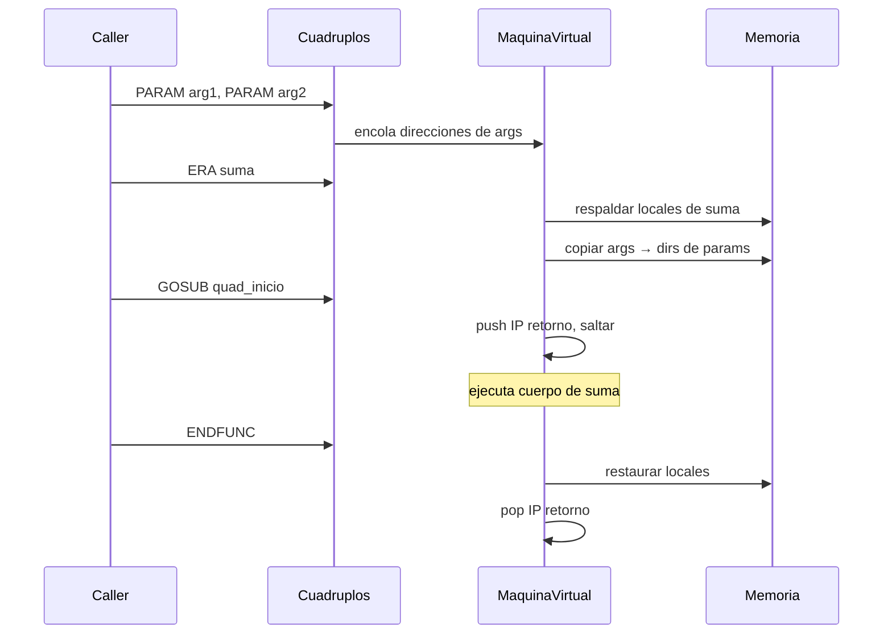
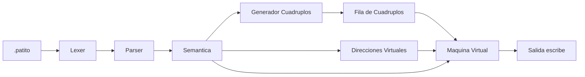

# Patito — Entrega 5 (Maquina Virtual y Memoria de Ejecucion)

Compilador completo del lenguaje **Patito** (TC3002B): scanner, parser, semantica, direcciones virtuales, cuadruplos y **Maquina Virtual** que ejecuta el codigo intermedio.

## Requisitos

- Python 3.10+
- [PLY](https://github.com/dabeaz/ply): `pip install -r requirements.txt`

## Uso rapido

```bash
cd Patito-entrega

# Compilar
python3 patito.py hola.patito

# Compilar y EJECUTAR en la Maquina Virtual
python3 patito.py --run hola.patito

# Ver cuadruplos, directorio, direcciones virtuales
python3 patito.py --quad hola.patito
python3 patito.py --dir  hola.patito
python3 patito.py --dv   hola.patito

# Tests automaticos
python3 patito.py --test           # compilacion (24 casos)
python3 patito.py --test-semantic  # errores semanticos (7 casos)
python3 patito.py --test-quad      # cuadruplos de ejemplos
python3 patito.py --test-vm         # ejecucion VM (6 casos)
```

---

## Lenguaje Patito (gramatica actual)

```
programa → PROGRAMA id ; vars funcs INICIO cuerpo FIN

vars     → VARS ( id (, id)* : tipo ; )*
funcs    → ( tipo_func id ( params ) vars cuerpo )*
tipo_func→ nula | entero | flotante
params   → ( id : tipo (, id : tipo)* )?

cuerpo   → { estatutos }
estatutos→ ( asignacion | llamada | si | mientras | escribe )*

asignacion → id = expresion ;
llamada    → id ( args ) ;
si         → si ( expresion ) cuerpo [ sino cuerpo ]
mientras   → mientras ( expresion ) haz cuerpo ;
escribe    → escribe ( valor (, valor)* ) ;

expresion  → exp ( op_rel exp )?
exp        → termino ((+|-) termino)*
termino    → factor ((*|/) factor)*
factor     → ( id | cte | ( expresion ) | - factor )
```

**Tipos:** `entero`, `flotante`, `nula` (funciones sin retorno).

---

## Distribucion de direcciones virtuales

Diseno en `direcciones_virtuales.py`. Cada variable, temporal y constante recibe un entero unico:

| Segmento   | Rango       | Uso |
|------------|-------------|-----|
| **Globales**   | 1000 – 1999 | Variables del bloque `vars` del programa |
| **Locales**    | 2000 – 4999 | Parametros y variables locales de funciones |
| **Temporales** | 5000 – 7999 | Resultados intermedios de expresiones |
| **Constantes** | 8000 – 9999 | Tabla de constantes (misma cte → misma dir.) |

Los cuadruplos almacenan **direcciones virtuales** (enteros), no nombres simbolicos.

### Como indexan la memoria de ejecucion

La VM (`memoria_ejecucion.py`) usa el numero de direccion virtual para decidir **en que segmento** guardar o leer un valor:

```
direccion virtual  →  segmento()  →  diccionario interno
     1005           →   global    →  _global[1005]
     2003           →   local     →  _local[2003]
     5010           →   temporal  →  _temporal[5010]
     8001           →   constante →  _constantes[8001]  (solo lectura)
```

Asi, el compilador y la VM se comunican solo con enteros; no hace falta buscar por nombre en tiempo de ejecucion.

---

## Memoria de Ejecucion

### Estructura: `MemoriaEjecucion`

```
┌─────────────────────────────────────────────────────────┐
│                  MemoriaEjecucion                        │
├──────────────┬──────────────┬──────────────┬─────────────┤
│  _global     │  _local      │  _temporal   │ _constantes │
│ 1000-1999    │ 2000-4999    │ 5000-7999    │ 8000-9999   │
│ dict         │ dict         │ dict         │ dict        │
└──────────────┴──────────────┴──────────────┴─────────────┘
         │              │
         │              └── respaldada/restaurada en ERA/ENDFUNC
         └── persiste durante toda la ejecucion
```

| Metodo | Descripcion |
|--------|-------------|
| `segmento(direccion)` | Devuelve `'global'`, `'local'`, `'temporal'` o `'constante'` |
| `leer(direccion)` | Obtiene el valor (default 0 si no existe) |
| `escribir(direccion, valor)` | Guarda valor (no permite escribir en constantes) |
| `cargar_constantes(tabla)` | Inicializa segmento de constantes desde el compilador |
| `cargar_tipos_desde_directorio(dir_func)` | Registra tipos de variables |
| `respaldar_locales(dirs)` | Guarda valores locales antes de entrar a funcion |
| `restaurar_locales(respaldo, dirs)` | Restaura al salir de funcion (ENDFUNC) |

### Estructuras auxiliares de la VM

```
┌─────────────────── MaquinaVirtual ───────────────────┐
│  cuadruplos[]     fila de codigo intermedio            │
│  mem              MemoriaEjecucion                     │
│  pila_retorno     Stack — direcciones de retorno GOSUB │
│  parametros[]     args pendientes de cuadruplos PARAM  │
│  respaldos        Stack — respaldos de memoria local   │
│  salida[]         valores impresos por escribe()       │
└────────────────────────────────────────────────────────┘
```

Flujo de llamada a funcion:



---

## Cuadruplos — operadores

| Operador | Descripcion | VM |
|----------|-------------|-----|
| `+`, `-`, `*`, `/`, `uminus` | Aritmetica | `_operar()` |
| `>`, `<`, `==`, `!=` | Relacional (resultado 0/1) | `_operar()` |
| `=` | Asignacion | `escribir(res, leer(arg1))` |
| `PRINT` | `escribe` | imprime arg1 (valor o letrero) |
| `GOTOF` | Salta si condicion es falsa | `if not leer(a1): ip = res` |
| `GOTO` | Salto incondicional | `ip = res` |
| `PARAM` | Pasa argumento | encola direccion del arg |
| `ERA` | Registro de activacion | respalda locales, asigna params |
| `GOSUB` | Llama funcion | push retorno, `ip = quad_inicio` |
| `ENDFUNC` | Fin de funcion | restaura locales, pop retorno |

---

## Puntos neurálgicos

### Funciones (declaracion e invocacion)

```
func → tipo id ( params ● ) vars { cuerpo } ●
estatuto → id ● ( llamada_arg ● ... ) ● ;
```

| Punto | Accion |
|-------|--------|
| ● `func_header` | `nueva_funcion` — registra en directorio, abre scope |
| ● `)` tras params | `quad_inicio = contador` — inicio del codigo de la funcion |
| ● vars dentro de func | params y locales reciben `local_dir()` |
| ● `func_footer` | `ENDFUNC` + cerrar scope |
| ● `call_id : ID` | validar funcion; `inicio_llamada()` |
| ● `llamada_arg : expresion` | evaluar exp → `PARAM, dir_arg, _, _` |
| ● `)` tras argumentos | validar cantidad/tipos → `ERA, nombre` + `GOSUB, _, _, quad_inicio` |

Ejemplo (`prueba_funciones.patito`):

```
  PARAM 1000        # x (arg 1)
  PARAM 8001        # 5 (arg 2)
  ERA   suma        # crear registro de activacion
  GOSUB 0           # saltar a quad_inicio de suma
```

### Expresiones, control y estatutos lineales

Ver secciones en entregas anteriores — sin cambios en gramatica.

---

## Programas de prueba

| Archivo | Que ejercita |
|---------|----------------|
| `hola.patito` | Asignacion, `escribe`, globales/constantes |
| `prueba_aritmetica.patito` | Precedencia, temporales |
| `prueba_relacional.patito` | `si` con `>` |
| `prueba_si.patito` | `si` / `sino` con saltos |
| `prueba_mientras.patito` | Ciclo con `GOTOF`/`GOTO` |
| `prueba_funciones.patito` | Locales, `PARAM`, `ERA`, `GOSUB`, `ENDFUNC` |
| `prueba_vm.patito` | Demo completa: aritmetica + funcion + escribe |

### Ejemplo de ejecucion

```bash
python3 patito.py --run prueba_funciones.patito
# Salida: suma15
```

---

## Archivos del proyecto

| Archivo | Rol |
|---------|-----|
| `patito_lexer.py` | Scanner (tokens) |
| `patito_parser.py` | Parser + puntos neurálgicos |
| `dir_funciones.py` | Directorio de funciones y tablas de variables |
| `semantic_cube.py` | Cubo semantico de tipos |
| `direcciones_virtuales.py` | Mapa de direcciones virtuales |
| `generador_cuadruplos.py` | Pilas, fila, generacion de cuadruplos |
| `memoria_ejecucion.py` | **Mapa de memoria de ejecucion** |
| `maquina_virtual.py` | **Interprete de cuadruplos** |
| `stack.py`, `queue.py` | Estructuras base |
| `patito.py` | Entrada principal y tests |

---

## Diagrama general del compilador


